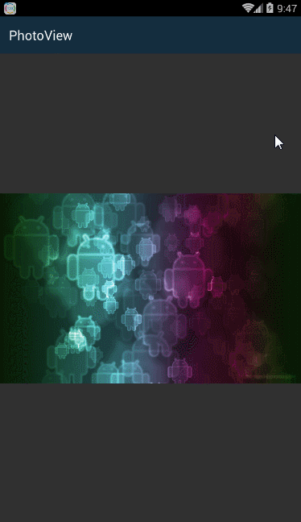

# PhotoView    
 
## apk
[PhotoView-1.0.1-sample.apk](https://github.com/Sing1/PhotoView/blob/master/app/app-debug.apk)
## gradle:
```groovy
dependencies {
    ...
    compile 'sing.photoview:library:1.0.1'
}
```
## Maven:
```xml
<dependency>
  <groupId>sing.photoview</groupId>
  <artifactId>library</artifactId>
  <version>1.0.1</version>
  <type>pom</type>
</dependency>
``` 

```JAVA     
PhotoView photoView = new PhotoView(mActivity);
```
PhotoView is a ImageView, you can use PhotoView instead of ImageView,for example：
```JAVA 
ImageLoader.displayImage(mActivity, images.get(position), photoView, screenWidth, screenHeight);
```
